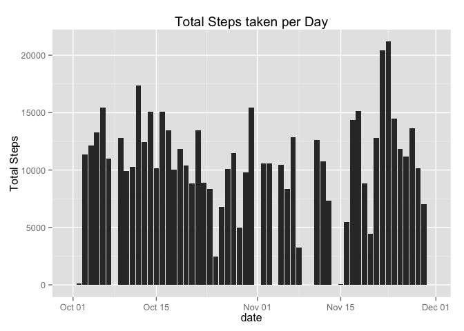
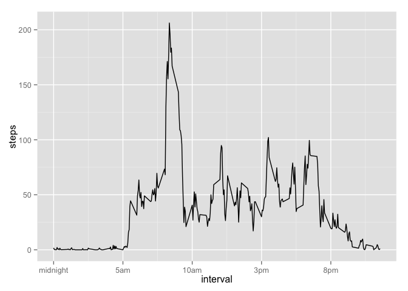
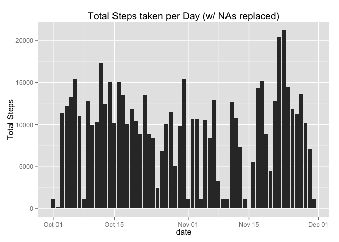
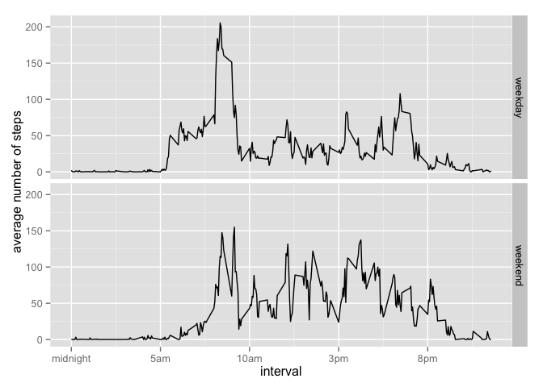

# Reproducible Research: Peer Assessment 1

```r
library('data.table')
library('ggplot2')
library('lubridate')
library('dplyr')
library('plyr')
```

## Loading and preprocessing the data
The activity data were included in the [github repository](https://github.com/rdpeng/RepData_PeerAssessment1) I forked from.  
I start by loading the data into R. 
The data in the repo is compressed, 
so I need to unzip it before loading it in.  
Notice that I'm converting the data frame into a data table. 
This will make the following analysis much easier.

```r
activity <- as.data.table(
  read.csv(
    unz("activity.zip","activity.csv")))
activity$date <- ymd(activity$date)
activity
```

```
##        steps       date interval
##     1:    NA 2012-10-01        0
##     2:    NA 2012-10-01        5
##     3:    NA 2012-10-01       10
##     4:    NA 2012-10-01       15
##     5:    NA 2012-10-01       20
##    ---                          
## 17564:    NA 2012-11-30     2335
## 17565:    NA 2012-11-30     2340
## 17566:    NA 2012-11-30     2345
## 17567:    NA 2012-11-30     2350
## 17568:    NA 2012-11-30     2355
```

```r
summary(activity)
```

```
##      steps             date               interval     
##  Min.   :  0.00   Min.   :2012-10-01   Min.   :   0.0  
##  1st Qu.:  0.00   1st Qu.:2012-10-16   1st Qu.: 588.8  
##  Median :  0.00   Median :2012-10-31   Median :1177.5  
##  Mean   : 37.38   Mean   :2012-10-31   Mean   :1177.5  
##  3rd Qu.: 12.00   3rd Qu.:2012-11-15   3rd Qu.:1766.2  
##  Max.   :806.00   Max.   :2012-11-30   Max.   :2355.0  
##  NA's   :2304
```


## What is mean total number of steps taken per day?
1. To answer this question, we begin by creating a histogram of the
total steps taken per day:

```r
total_steps <- activity[,sum(steps,na.rm=TRUE),by=date]
setnames(total_steps,"V1","steps")
c <- ggplot(total_steps,aes(date,steps))
c + geom_bar(stat="identity") + ylab("Total Steps") + ggtitle("Total Steps taken per Day")
```

 

The zeros in some days are caused by missing data (NAs). Just to verify that this is true, let's check October 1, 2012:

```r
summary(filter(activity,date==ymd("2012-10-01")))
```

```
##      steps          date               interval     
##  Min.   : NA   Min.   :2012-10-01   Min.   :   0.0  
##  1st Qu.: NA   1st Qu.:2012-10-01   1st Qu.: 588.8  
##  Median : NA   Median :2012-10-01   Median :1177.5  
##  Mean   :NaN   Mean   :2012-10-01   Mean   :1177.5  
##  3rd Qu.: NA   3rd Qu.:2012-10-01   3rd Qu.:1766.2  
##  Max.   : NA   Max.   :2012-10-01   Max.   :2355.0  
##  NA's   :288
```
Notice that steps is all NAs.

2. The Mean and Median total steps can now be easily calculated:

```r
mean_steps <- mean(total_steps$steps)
median_steps <- median(total_steps$steps)
mean_steps
```

```
## [1] 9354.23
```

```r
median_steps
```

```
## [1] 10395
```
**The mean number of steps per day is ``9354.2295082``**  
**The median number of steps per day is ``10395``**


## What is the average daily activity pattern?
This step is similar to the last one, but instead of summing for each day, we're going to average over each interval. What's nice about this, is that it will ignore the NAs, unlike with the sum where the NAs were effectively zeros.


```r
interval_means <- activity[,mean(steps,na.rm=TRUE),by=interval]
setnames(interval_means,"V1","steps")
max_interval <- interval_means$interval[which.max(interval_means$steps)]
max_interval <- sub("(..$)",":\\1",max_interval)
```

Now we just need to plot it:

```r
c <- ggplot(interval_means,aes(interval,steps))
c + geom_line() +scale_x_continuous(breaks = c(0,500,1000,1500,2000),
                                    labels = c("midnight", "5am",
                                               "10am", "3pm", "8pm"))
```

 

**The interval of maximum steps occurs at ``8:35``**


## Imputing missing values
1. Calculate and report the total number of missing values in the dataset.  
This is easily computed as such:

```r
total_NAs <- sum(is.na(activity))
steps_NAs <- sum(is.na(activity$steps))
```
The total number of missings values in the dataset is ``2304`` which is the same as the number of missing values in the steps column (``2304``) showing that the steps column is the only location for NAs.

2. To fill in the missing values, I will use the median number of steps for the particular interval.

3. Create a new dataset that is equal to the original dataset but with the missing data filled in.

```r
complete_activity <- activity
missing_intervals <- activity$interval[is.na(activity$steps)]

interval_medians <- activity[,median(steps,na.rm=TRUE),by=interval]
setnames(interval_medians,"V1","steps")

interval_indices <-match(missing_intervals,interval_medians$interval)
complete_activity$steps[is.na(activity$steps)] <- interval_medians$steps[interval_indices]
```

To test that this worked, let's check the total number of missing values:


```r
sum(is.na(complete_activity))
```

```
## [1] 0
```

I from earlier, I know of at least one day that was all NAs. That day
should now be equal to the median of all days for each interval:

```r
emptyday_steps <- filter(complete_activity,date==ymd("2012-10-01"))$steps
all.equal(emptyday_steps,interval_medians$steps)
```

```
## [1] TRUE
```

4. Make a histogram of the total number of steps taken each day and Calculate and report the mean and median total number of steps taken per day. Do these values differ from the estimates from the first part of the assignment? What is the impact of imputing missing data on the estimates of the total daily number of steps?

This is basically the same as the first part of the assignment:

```r
filled_total_steps <- complete_activity[,sum(steps,na.rm=TRUE),by=date]
setnames(filled_total_steps,"V1","steps")
c <- ggplot(filled_total_steps,aes(date,steps))
c + geom_bar(stat="identity") + ylab("Total Steps") + ggtitle("Total Steps taken per Day (w/ NAs replaced)")
```

 


```r
filled_mean_steps <- mean(filled_total_steps$steps)
filled_median_steps <- median(filled_total_steps$steps)
filled_mean_steps
```

```
## [1] 9503.869
```

```r
filled_median_steps
```

```
## [1] 10395
```
**The mean number of steps per day (with NAs replaced with median values for those intervals) is ``9503.8688525``, compared to ``9354.2295082`` without the NAs replaces**  
**The median number of steps per day is ``10395`` compared to ``10395`` without the NAs replaced**

The Mean number of steps increases a little (``149.6393443`` steps) while the median does not change. The median steps for each interval is low, so the total steps for the days with replaced values don't affect the median.

## Are there differences in activity patterns between weekdays and weekends?

1. Create a new factor variable in the dataset with two levels -- "weekday" and "weekend" indicating whether a given date is a weekday or weekend day.

Since I already converted the date column to a date class, this is pretty simple. Using mapvalues from plyr lets the levels be correctly labelled.


```r
is_weekend <- as.factor(weekdays(complete_activity$date) %in% c("Saturday","Sunday"))
levels(is_weekend) <- mapvalues(levels(is_weekend),from=c("TRUE","FALSE"),to=c("weekend","weekday"))
complete_activity$weekpart <- is_weekend
summary(complete_activity)
```

```
##      steps          date               interval         weekpart    
##  Min.   :  0   Min.   :2012-10-01   Min.   :   0.0   weekday:12960  
##  1st Qu.:  0   1st Qu.:2012-10-16   1st Qu.: 588.8   weekend: 4608  
##  Median :  0   Median :2012-10-31   Median :1177.5                  
##  Mean   : 33   Mean   :2012-10-31   Mean   :1177.5                  
##  3rd Qu.:  8   3rd Qu.:2012-11-15   3rd Qu.:1766.2                  
##  Max.   :806   Max.   :2012-11-30   Max.   :2355.0
```
2. Make a panel plot containing a time series plot (i.e. type = "l") of the 5-minute interval (x-axis) and the average number of steps taken, averaged across all weekday days or weekend days (y-axis)

This is similar to the earlier time series plot, but now instead of 
one column to group on, we have two:

```r
mean_steps <- complete_activity[,mean(steps,na.rm=TRUE),by=c("interval","weekpart")]
setnames(mean_steps,"V1","steps")
c <- ggplot(mean_steps,aes(interval,steps))
c <- c + geom_line()
c <- c + scale_x_continuous(breaks = c(0,500,1000,1500,2000),
                                    labels = c("midnight", "5am",
                                               "10am", "3pm", "8pm"))
c <- c + ylab("average number of steps")
c + facet_grid(weekpart ~ .)
```

 

Weekdays have many more steps earlier in the day while weekends have more steps evenly throughout the day. Very cool.

**I hope you've enjoyed my Rmarkdown assignment!!**
